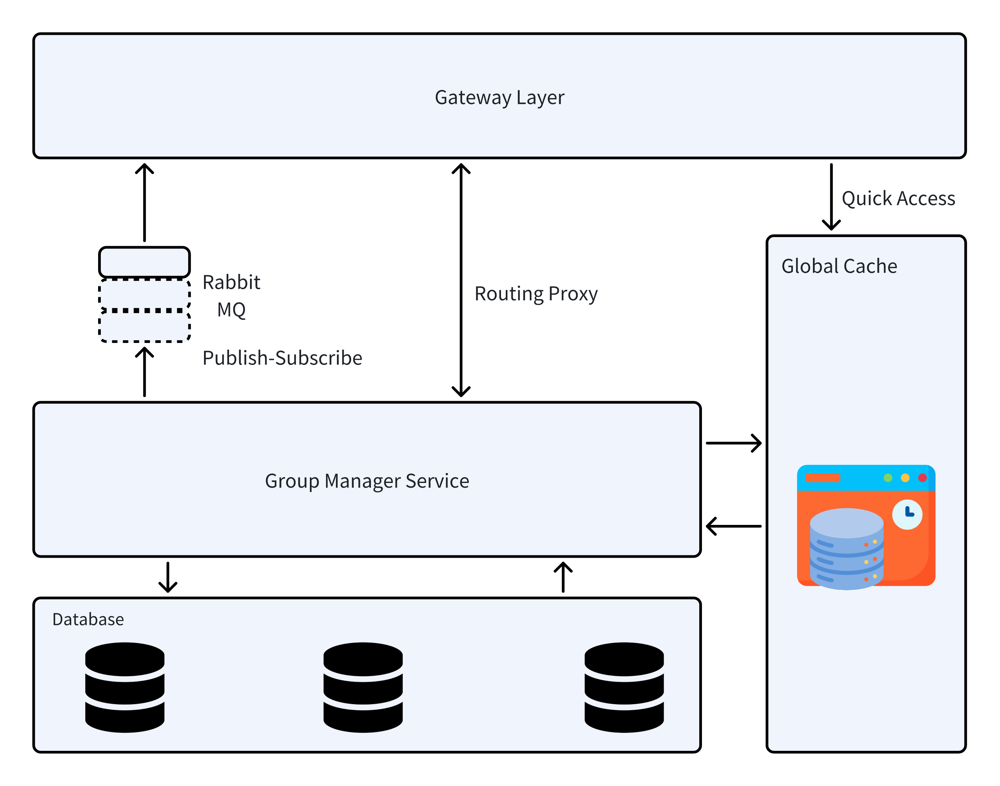

# Group Management Service (Real-Time Updates/Notification)

This is a multi-module project that consists of a Spring Boot based **group-manage-service** and a Node.js based **gateway-layer**. The project uses Maven to build the Spring Boot module and npm (invoked via Maven) to build the gateway-layer. The services run together using Docker Compose.

## UML Diagram


## Prerequisites

- Java 17 (or the required version)
- Maven
- Node.js
- Docker and Docker Compose

## Building the Project

To build the project and install the Maven artifacts (skipping tests), run:

```bash
mvn clean install -DskipTests
```

## Running the Services

To build and start all services using Docker Compose, execute:
```bash
docker-compose up --build
```

## Testing Service

To test all services, execute:
```bash
mvn test
```

## Accessing Swagger UI

When your application is running (locally or deployed), you can access the Swagger UI at the following URL:

[http://localhost:8080/swagger-ui/index.html](http://localhost:8081/swagger-ui/index.html)

Simply open this URL in your web browser to view the API documentation and test endpoints.

